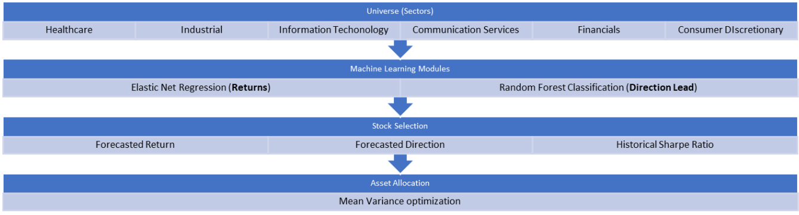

# Algotrading_Strategy_Fintech
The objective is to create a realistic investment strategy based on several machine learning techniques seen during the masters course *Machine Learning Applied to Financial Data*, at HEC Montréal.

# Disclaimer
This repository was built as a part of a course webproject, and the data and techniques assume rather unrealistic constraints that would make the strategy completely unprofitable and extremely risky in real life. 
The contents of this repository do not constitute by any means any financial advise and **we waive ourselves from all legal liability** in the use or misuse of this stategy. 

# Trading Strategy 

We use an automatic S&P 500 sub-universe selection algorithm based on economic sectors and stocks with largest market capitalisation. At the beginning of every month, we subset a window of "recent" past data (e.g., two years), and for each combination of sector and corresponding stocks, we perform backward linear feature selection, followed by Elastic Net Regression to anticipated returns, and a Random Forest to anticipate their trajectory (up or down). We filter assets emphasizing on anticipated returns, direction and the Sharpe ratio. With the help of a modified minimum-variance optimization framework based on a different set of time-series-based forecasted returns and volatility, we rebalance the portfolio by longing based on the optimized weights. We then hold until the beginning of next month, where we close all positions, and perform the strategy again.  

# Workflow

# Performance
The backtest spans over a 5-year period, using a rolling 24-month window to forecast the metrics for the subsequent month. Our data, however, consists of weekly Wednesday adjusted close. We benchmarked the performance against the S&P 500 index. As evident from the graph below, the portfolio has consistently outperformed the index on a monthly basis. The portfolio, however, also displays significant drawdowns indicating high volatility and large declines from peaks, indicating a high-level of risk. 

# Machine Learning-based Strategy

As mentioned in the Trading Strategy section, every month, we leverage a fixed window of past data, in this case 2 years, or 24 months.  For each of these, we extract the features for that range, but we also compute a couple of "dynamic features", given by the following:  

- **Shifted SARIMA(p,d,q)** features for different combinations of *p,d,q*. The goal is to forecast the realized returns 4-weeks ahead, so that these are introduced to the historical data as predictive features.  The SARIMA (Seasonal Autoregressive Integrated Moving Average) is a statistical time-series model that combines the AR (autoregressive on the target) models, the MA (moving average of past noise), differencing and seasonality modelling to approximate the behaviour of the stochastic process in question. The mathematical expression for this model is complex in nature, and therefore omitted here for brevity.  
- **Shifted GARCH(1,1)** features. This feature reflects a 4-weeks ahead volatility forecast for the asset.  Generalized Autoregressive Conditional Heteroskedasticity (GARCH) with specification (1,1) can be described as follows:

$$
\begin{cases}
y_t = \mu + \epsilon_t  &,\text{(observed data as function of mean and error term)}\\
\sigma^2_t = \alpha_0 + \alpha_1 \epsilon_{t-1}^2 + \beta_1 \sigma_{t-1}^2 
&,\text{(recursive model for the conditional variance)}\\
\epsilon_t = \sigma_t z_t &,\text{(innovations term)} \\
z_t \sim N(0, 1) &,\text{(white-noise term)}
\end{cases}
$$

These features have two goals: (i) to create informative predictive features used in the regression and classification models and (ii) function as the future-shifted mean and volatility return vectors used in the min-variance framework, as opposed to the raw historical data. 

## Regularized Multiple Linear Regression (Elasticnet)

Subsequent to feature selection, an Elastic Net regression model was implemented, which seamlessly blends the penalties from both Lasso and Ridge regression, succinctly expressed by the following objective function: 

$$
\underset{\beta}{\min}
\dfrac{1}{N}
\sum_{i=1}^{N}\ell (y_i, x_{i}^T\beta)
+ 
\lambda\left[
  \alpha ||\beta||_1 
  + \dfrac{1}{2}(1-\alpha)||\beta||_{2}^{2}
\right]
$$

## Random Forests 

Random Forest Model for Classification 

Mathematically, a Random Forest can be described as a collection of decision trees $T(x, \Theta_k)$
parameters for the $k$ -th tree. These trees are trained independently on different bootstraps samples of the data (bagging), and their predictions are aggregated to produce a final prediction. This modified bagging methods reduces variance in the predictions, making it a more robust prediction algorithm.  

In the case of classification, with $C$ classes, the prediction of a Random Forest Model $\mathcal{F}(x)$ for input features $x$ is given by:  

$$
\mathcal{F}(x) = \arg\max_{c \in C} \sum_{k=1}^{K} I(T(x; \Theta_k) = c)
$$

That is, this a majority vote of the predictions for each class, over the random forest parameter space.

In our case, $C=2$, since we are predicting the direction of the historical returns for this period: i.e., "up" or "down".

## Stock picking logic

To choose the best performing stocks, we combine these methods along with the historical Sharpe ratio using the following heuristic:  

$$
\text{Choose stock }x \text{ if }
\begin{cases}
    \texttt{forecasted\_return > 0 \& forecasted\_direction == "up"} \\ 
    \texttt{OR} \\ 
    \texttt{sharpe\_ratio > 0.3 \& forecasted\_direction == "up"} \\ 
    \texttt{OR} \\ 
    \texttt{sharpe\_ratio > 0.5}
\end{cases}
$$

# Attribution 

- **Hair Parra**: Design, architecture, implementation, overall strategy, code cleaning and optimization, feature engineering, modelling and portfolio optimization, simulation, documentation, repository and project setup, final report.   
- **Prateek**: Data collection, feature engineering, report. 
- **Xiao Xue**: Modelling, testing, experimentation, final report. 
- **Kriti**: Portfolio optimization, final report. 

# Aside

### On the rolling window logic

1. Sector $G$ contains tickers $\{S_1,S_1,\dots,  S_{|G|}\}$, where $|G|$= number of stocks per sector (before selection). 
2. For each ticker, want to calculate **current window:**

$$
\left[
  t_1 = \text{week } W_{s\times\tau}
  \;,\;
  t_{12} = \text{week } W_{s\times\tau + 11}
\right]
$$ 

e.g. with $s=1$ (slide one month at the time)

$$
\begin{cases}
\tau = 1 \implies [t_1 = W_{1} \;,\; t_{12} = W_{12}] \\ 
\tau = 2 \implies [t_1 = W_{2} \;,\; t_{12} = W_{13}] \\ 
\vdots \\ 
\tau = i \implies [t_1 = W_{i} \;,\; t_{12} = W_{i+11}] \\ 
\vdots \\ 
\tau = T \implies [t_1 = W_{T-12} \;,\; t_{12} = W_{T}]
\end{cases}
$$

