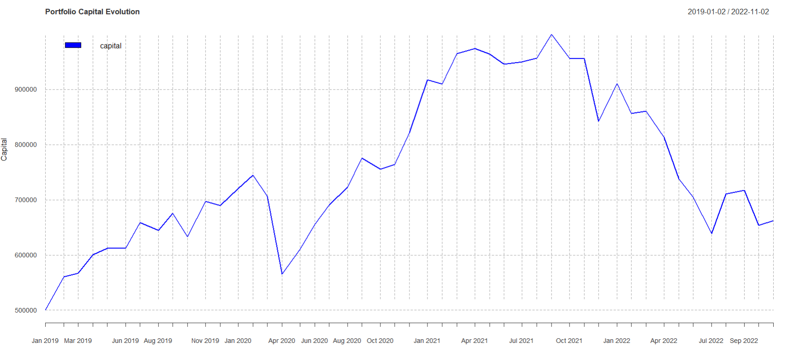
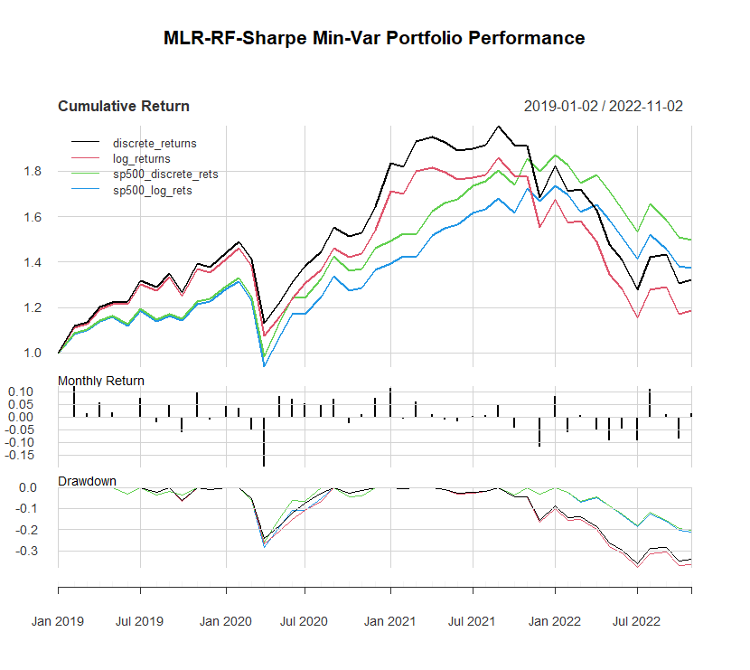
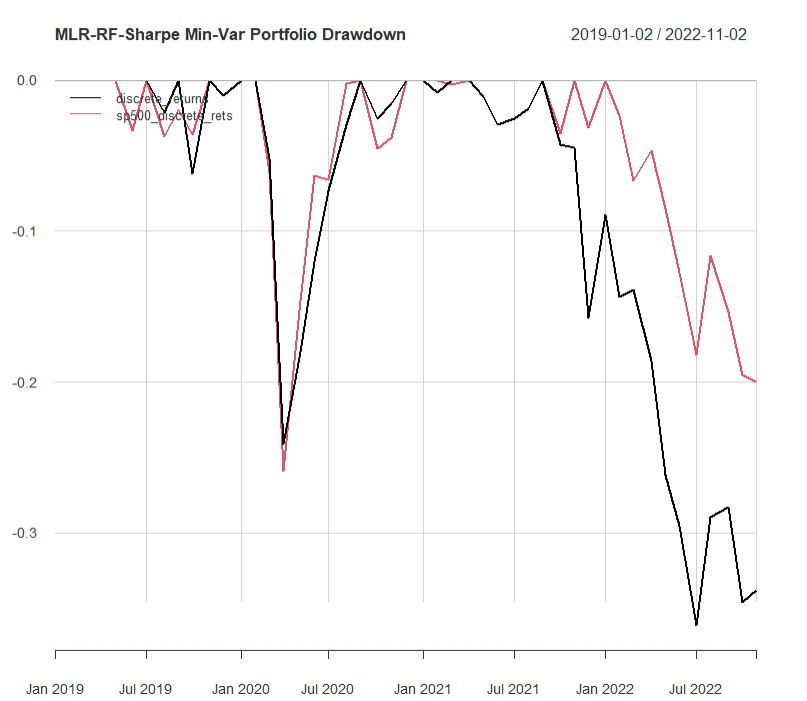

---
header-includes:
  - \usepackage{amsmath}
  - \usepackage{amssymb}
  - \usepackage{amsthm}
  - \usepackage{fancyhdr}
  - \pagestyle{fancy}
  - \fancyhead[CO,CE]{Strategy Report}
  - \fancyfoot[CO,CE]{Hair Parra, XiaoXue, Kriti Bhaya, Prateek Sinha}
  - \fancyfoot[LE,RO]{\thepage}
title: "Report (ML Fin Data - Project 1)"
author: "Hair Parra, XiaoXue, Kriti Bhaya, Prateek Sinha"
geometry: margin=1.3cm
fontsize: 11pt
always_allow_html: true
output: 
    pdf_document: 
      extra_dependencies: ["array", "amsmath","booktabs"]
sansfont: Arial
---

\newtheorem{assumption}{Assumption}[assumption]
\newtheorem{theorem}{Theorem}
\theoremstyle{definition}
\newtheorem{definition}{Definition}
\newtheorem{proposition}{Proposition}
\newtheorem{example}{Example}
\newtheorem{remark*}{Remark}
\newtheorem{aside*}{Aside}
\newtheorem{exercise*}{Exercise}

```{r setup, include=FALSE}
knitr::opts_chunk$set(echo = TRUE)
knitr::opts_chunk$set(fig.width=9, fig.height=6) 

# configurations for plot 
my_plot_hook <- function(x, options)
  paste("\n", knitr::hook_plot_tex(x, options), "\n")
knitr::knit_hooks$set(plot = my_plot_hook)
```


# Strategy Description


$$
N^{runs} = \left\lfloor
    \dfrac{N_{months} - N_W}{s}
\right\rfloor
+ 1
$$

### $\tau$ and window logic


1. Sector $G$ contains tickers $\{S_1,S_1,\dots,  S_{|G|}\}$, where $|G|$= number of stocks per sector (before selection).
2. For each ticker, want to calculate **current window:**

$$
\left[
  t_1 = \text{week } W_{s\times\tau}
  \;,\;
  t_{12} = \text{week } W_{s\times\tau + 11}
\right]
$$

{width=75%}

{width=75%}

{width=75%}

# Machine Learning Components


$$
\mathcal{L}(\beta)
=
\dfrac{1}{2}
\sum_{i=1}^{n}(y_i - x_{i}^T\beta)^{2}
+
\lambda\left[
  \alpha ||\beta||_1
  + (1-\alpha)||\beta||_{2}^{2}
\right]
$$


# Pros, Cons, and Comments


